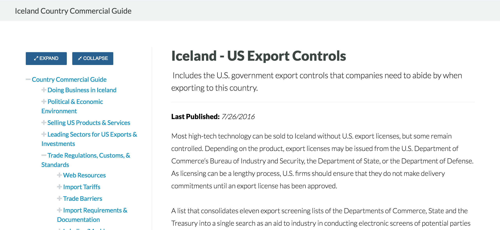

User powered content, flowing through the circle of life: 

1. Salesforce input 

2. Elasticsearch endpoint 

3. React app search  

4. Automated webpages (where I come in)

`Visualforce` `Bootstrap` `CSS` `JavaScript`