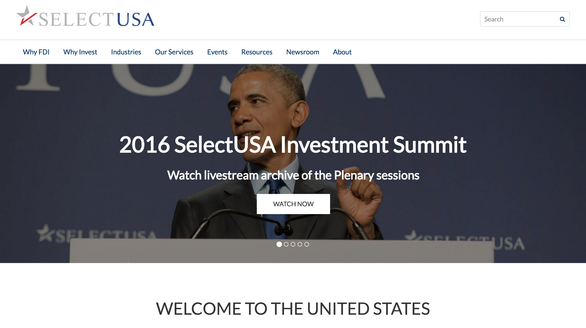
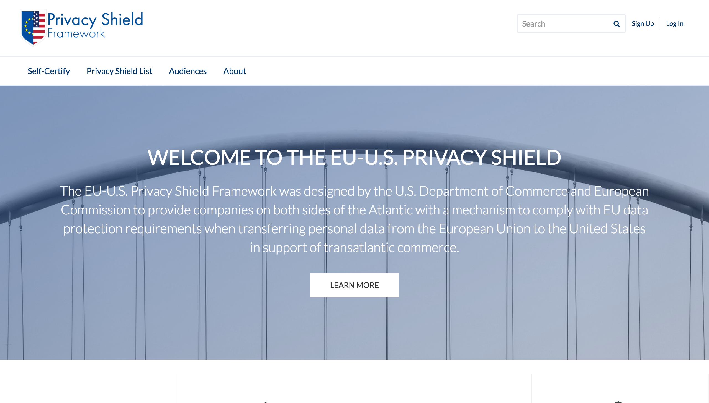

Years in the making, finnally launched the ITA/DOC enterprise websites. Worked on a strong team made up of studs. I was fortunate enough to lead and build the public-facing side.

`Visualforce` `Bootstrap` `CSS` `JavaScript` `PSD` `Unsplash` `Salesforce`